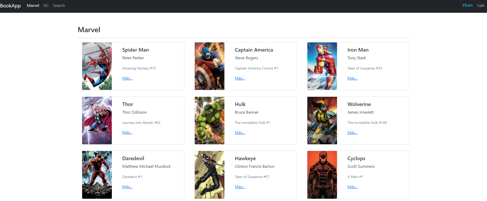
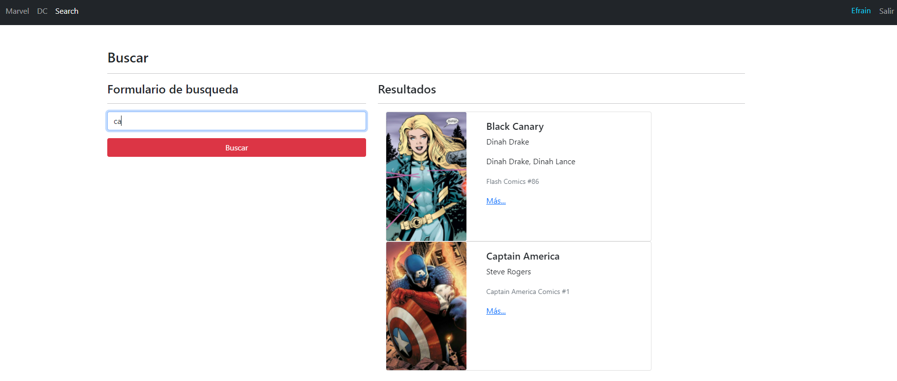

# Buscador de heroes DC/Marvel
En esta aplicación se uso data estatica sobre heroes de DC y Marvel, ademas se vio los sigueintes temas:
- Buscador de heroes por nombre
- Se usa el LocalStorage para guardar datos como urls para no perder la busqueda u otras cosas
- Usamos 1 hook personalizado para los formularios
- Hacemos protección de rutas tanto publica o privada
- Usamos Redux para manejar las acciones de la app

## Tecnologías usadas:
- HTML
- CSS
- JavaScript
- React
- Redux

## Capturas de la aplicación
>Login

> Dashboard

>Busqueda

